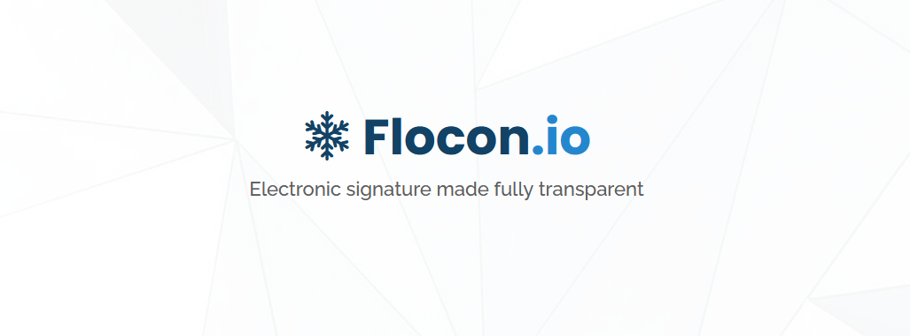

  

# Flocon.io - A blockchain-based electronic signature system

## Short Description

**Flocon.io** is a decentralized **E-Signature Service** that relies on the [Avalanche blockchain](https://www.avax.network/), [Moralis Web3](https://moralis.io/) and [IPFS](https://ipfs.io/) for its signature trails.

## Getting Started

In order to run **Flocon.io**, you will need to set:
- a [MongoDB](https://www.mongodb.com/) database ;
- a [Moralis Web3](https://moralis.io/) database.

Then you must report your databases characteristics to:
- `Flocon\appsettings.json` ;
- `Flocon\Views\AuthLogin.cshtml`.

You can now compile using Visual Studio or `dotnet publish ROOT_FOLDER_OF_THE_PROJECT`.

Enjoy!

